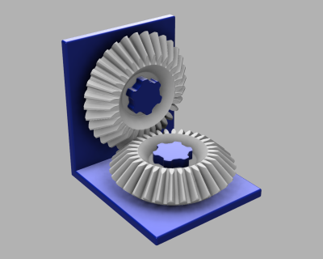
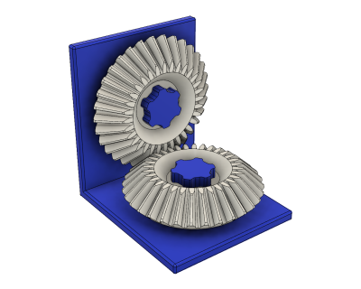

# Bevel Gear Test (12/2018)

<table>
<tr>
<td></td>
<td></td>
</tr>
</table>

A test fixture for the [parametric bevel gear](/parametric-bevel-gear).

**Design**: [Bevel Gear Test v13.f3z](Bevel%20Gear%20Test%20v13.f3z) (Fusion 360 Archive)

**Design**: https://a360.co/2SRN27a (A360)

**STLs**:

  * [Bevel Gear 1m 32t.stl](stls/Bevel%20Gear%201m%2032t.stl)
  * [Frame.stl](stls/Frame.stl)
  * [Perpendicular Axle.stl](stls/Perpendicular%20Axle.stl)
  * [Perpendicular Bolt.stl](stls/Perpendicular%20Bolt.stl)
  * [Shaft Bolt.stl](stls/Shaft%20Bolt.stl)

**Recommended Print Settings:** 0.20mm layer height, 20% infill

**License**: 
