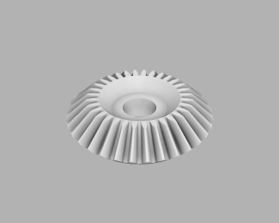
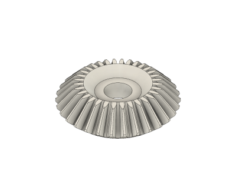
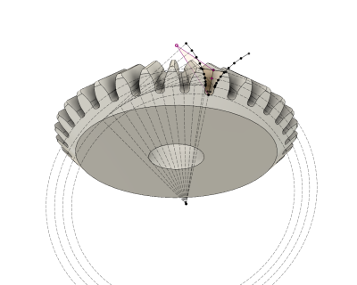
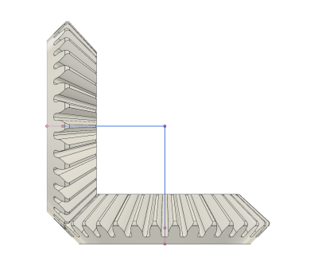

# Bevel Gear (12/2018)

<table>
<tr>
<td></td>
<td></td>
</tr>
<tr>
<td></td>
<td></td>
</tr>
</table>

A parametric 90° bevel gear, made with the involute curve tangent line [approximation](https://nptel.ac.in/courses/116102012/40), as Fusion 360 doesn't support equation driven curves (yet). Module, number of teeth, height, bore diameter, and pressure angle are adjustable parameters. See the [bevel gear test](/bevel-gear-test) for a test model using these bevel gears.

**Design**: [Parametric Bevel Gear v29.f3d](Parametric%20Bevel%20Gear%20v29.f3d) (Fusion 360 Archive)

**Design**: https://a360.co/2F2h44H (A360)

**STLs**: [Bevel Gear 1m 32t.stl](stls/Bevel%20Gear%201m%2032t.stl)

**Recommended Print Settings:** 0.20mm layer height, 20% infill

**Thingiverse:** https://www.thingiverse.com/thing:3336648

**License**: 

### Usage

Standard ISO gears are specified by two top-level parameters: gear module and gear teeth. Gear module is the pitch of one tooth on its reference diameter, and should be equal between interacting gears. Gear teeth are chosen to achieve the desired gear ratio between interacting gears. These parameters are exposed in the design as `BEVEL_GEAR_MODULE` and `BEVEL_GEAR_TEETH`, respectively. Since this design is currently fixed to 90° placement of interacting bevel gears, `BEVEL_GEAR_TEETH` should also be equal between interacting gears and the gear ratio is limited to 1.

The reference diameter of a gear is computed with `BEVEL_GEAR_MODULE*BEVEL_GEAR_TEETH`, which will be equal between interacting gears for a 90° configuration. With this design, the "center" of the bevel gear is defined as the middle of the inner disc, whose height is `BEVEL_GEAR_HEIGHT`. Interacting gears should be placed such that the reference lines formed from the "center" of the bevel gears to half the reference diameter is coincident and at a 90° angle. The design includes a "Placement Guide" sketch which shows this reference line. See the image above for a placement example with these reference lines.

This design addresses material shrinkage and printing accuracy discrepancies by scaling the gear teeth with the parameter `BEVEL_GEAR_TOOTH_SCALE`, which ranges from 0.0-1.0 and defaults to 0.925. This parameter scales the width of the gear teeth along the reference diameter, where 1.0 is the nominal width. If you do encounter binding or slop, you can adjust `BEVEL_GEAR_TOOTH_SCALE` to compensate.

After building several prototypes that varied this scaling factor from 0.90 to 1.00, I found that 0.925 - 0.950 yielded good results for me with no binding, minimal play, and little break-in. Scale factors closer to nominal (1.0) may work as well, but may require some "grinding" to break-in the gears. As always, your results may vary with printer setup, material, etc.

Aside from the actual gear related parameters, there are also parameters to control the height (`BEVEL_GEAR_HEIGHT`) of the inner disc and its hole diameter (`BEVEL_GEAR_HOLE_DIAMETER`). These parameters do not affect the gear placement, and can be changed independently for interacting gears.

### Parameter Summary

* `BEVEL_GEAR_MODULE` - pitch of gears, user specified (default 1)
* `BEVEL_GEAR_TEETH` - number of teeth, user specified (default 32)
* `BEVEL_GEAR_HEIGHT` - height of inner disc, user specified (default 5mm)
* `BEVEL_GEAR_HOLE_DIAMETER` - hole diameter in inner disc, user specified (default 5mm)
* `BEVEL_GEAR_TOOTH_SCALE` - tooth scaling for process margin (default 0.925)
* `BEVEL_GEAR_PRESSURE_ANGLE` - pressure angle (default 20 degrees)
* `BEVEL_GEAR_FILLET_RADIUS` - dedendum fillet radius (default (0.38 * gear module) mm)
* `BEVEL_GEAR_EDGE_FILLET` - teeth edge fillet on Z axis (default 0.5mm)

### Resources

See section 2 of KHK's "The ABC's of Gears" guide on computing gear dimensions: https://www.khkgears.co.jp/kr/gear_technology/pdf/gearabc_b.pdf
