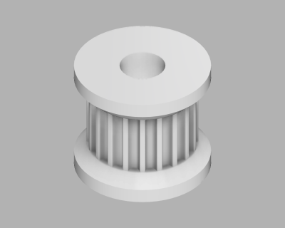
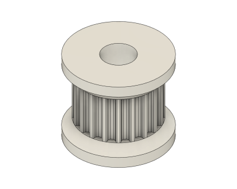
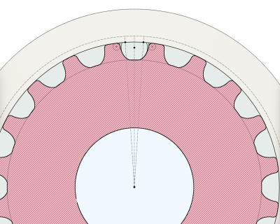

# Parametric GT2 Pulley (04/2020)

<table>
<tr>
<td></td>
<td></td>
</tr>
<tr>
<td></td>
</tr>
</table>

A parametric pulley for 2mm pitch GT2 timing belts. Number of teeth, face width, lip thickness, outer diameter, and bore diameter are adjustable parameters. See the [belt demo](https://github.com/vsergeev/3d-misc-projects/tree/master/belt-demo) for a test model using these pulleys.

**Design**: [Parametric GT2 Pulley v9.f3d](Parametric%20GT2%20Pulley%20v9.f3d) (Fusion 360 Archive)

**Design**: https://a360.co/2KkRSb4 (A360)

**STLs**: [GT2 Pulley 20t.stl](stl/GT2%20Pulley%2020t.stl)

**Recommended Print Settings:** 0.20mm layer height, 15% infill, no supports

**Thingiverse:** https://www.thingiverse.com/thing:4304802

**License**: 

### Parameter Summary

* `GT2_PULLEY_TEETH` - number of teeth (default 20)
* `GT2_PULLEY_Z_FACE_WIDTH` - face width (default 7mm)
* `GT2_PULLEY_Z_LIP_THICKNESS` - lip thickness (default 3mm)
* `GT2_PULLEY_XY_OUTER_DIAMETER` - outer diameter (default 15mm)
* `GT2_PULLEY_XY_BORE_DIAMETER` - bore diameter (default 5mm)
