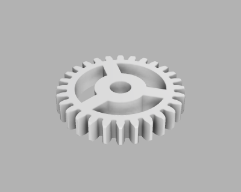
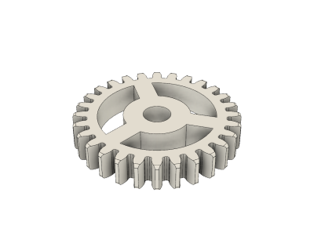
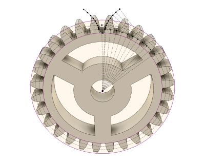

# Parametric Spur Gear (12/2018)

<table>
<tr>
<td></td>
<td></td>
</tr>
<tr>
<td></td>
</tr>
</table>

A parametric spur gear, made with the involute curve tangent line [approximation](https://nptel.ac.in/courses/116102012/40), as Fusion 360 doesn't support equation driven curves (yet). Module, number of teeth, height, hole diameter, and pressure angle are adjustable parameters. See the [parametric gear toy](https://github.com/vsergeev/3d-gear-toy) for a test model using these gears.

**Design**: [Parametric Spur Gear v34.f3d](Parametric%20Spur%20Gear%20v34.f3d) (Fusion 360 Archive)

**Design**: https://a360.co/2BSMisY (A360)

**STLs**: [Spur Gear 1m 28t.stl](stls/Spur%20Gear%201m%2028t.stl)

**Recommended Print Settings:** 0.20mm layer height, 20% infill

**Thingiverse:** https://www.thingiverse.com/thing:3336641

**License**: 

### Usage

Standard ISO spur gears are specified by two top-level parameters: gear module and gear teeth. Gear module is the pitch of one tooth on its reference diameter, and should be equal between interacting gears. Gear teeth are chosen to achieve the desired gear ratio between interacting gears. These parameters are exposed as `GEAR_MODULE` and `GEAR_TEETH`, respectively.

The reference diameter of a gear is computed with `GEAR_MODULE*GEAR_TEETH`. With this design, interacting gears should be placed at exactly `(d1 + d2)/2` apart, where `d1` and `d2` are the reference diameters of the two interacting gears.

For example, using a `GEAR_MODULE` of 1, for two gears with `GEAR_TEETH` of 28 and 37:

* The gear ratio is `37/28` = ~1.32
* The reference diameter of the smaller gear is `1*28` = 28mm
* The reference diameter of the larger gear is `1*37` = 37mm
* The gear axes should be placed `(28+37)/2` = 32.5mm apart

This design addresses material shrinkage and printing accuracy discrepancies by scaling the gear teeth with the parameter `GEAR_TOOTH_SCALE`, which ranges from 0.0-1.0 and defaults to 0.925. This parameter scales the width of the gear teeth along the reference diameter, where 1.0 is the nominal width. If you do encounter binding or slop, you can adjust `GEAR_TOOTH_SCALE` to compensate.

After building several prototypes that varied this scaling factor from 0.90 to 1.00, I found that 0.925 - 0.950 yielded good results for me with no binding, minimal play, and little break-in. Scale factors closer to nominal (1.0) may work as well, but may require some "grinding" to break-in the gears. As always, your results may vary with printer setup, material, etc.

If possible, it's a good idea to use co-prime gear teeth for interacting gears. In the example above, the greatest common divisor of 28 and 37 is 1, so the teeth are co-prime. On the other hand, a pair of gears with 28 and 36 teeth are not, as the greatest common divisor of 28 and 36 is 4. Co-prime gear teeth results in wear that is evenly distributed among all the gear teeth over time.

Aside from the actual gear related parameters, there are also parameters to control the height (`GEAR_HEIGHT`), hole diameter (`GEAR_HOLE_DIAMETER`), and slot width (`GEAR_SLOT_WIDTH`).

### Parameter Summary

* `GEAR_MODULE` - pitch of gears, user specified (default 1)
* `GEAR_TEETH` - number of teeth, user specified (default 28)
* `GEAR_HEIGHT` - height of gear, user specified (default 5mm)
* `GEAR_HOLE_DIAMETER` - hole diameter, user specified (default 5mm)
* `GEAR_TOOTH_SCALE` - tooth scaling for process margin (default 0.925)
* `GEAR_SLOT_WIDTH` - width of slot cut outs (default (root diameter / 7) mm)
* `GEAR_PRESSURE_ANGLE` - pressure angle (default 20 degrees)
* `GEAR_FILLET_RADIUS` - dedendum fillet radius (default (0.38 * gear module) mm)
* `GEAR_TIP_FILLET_RADIUS` - teeth edge fillet on Z axis (default 0.5mm)

### Resources

See section 2 of KHK's "The ABC's of Gears" guide on computing gear dimensions: https://www.khkgears.co.jp/kr/gear_technology/pdf/gearabc_b.pdf
